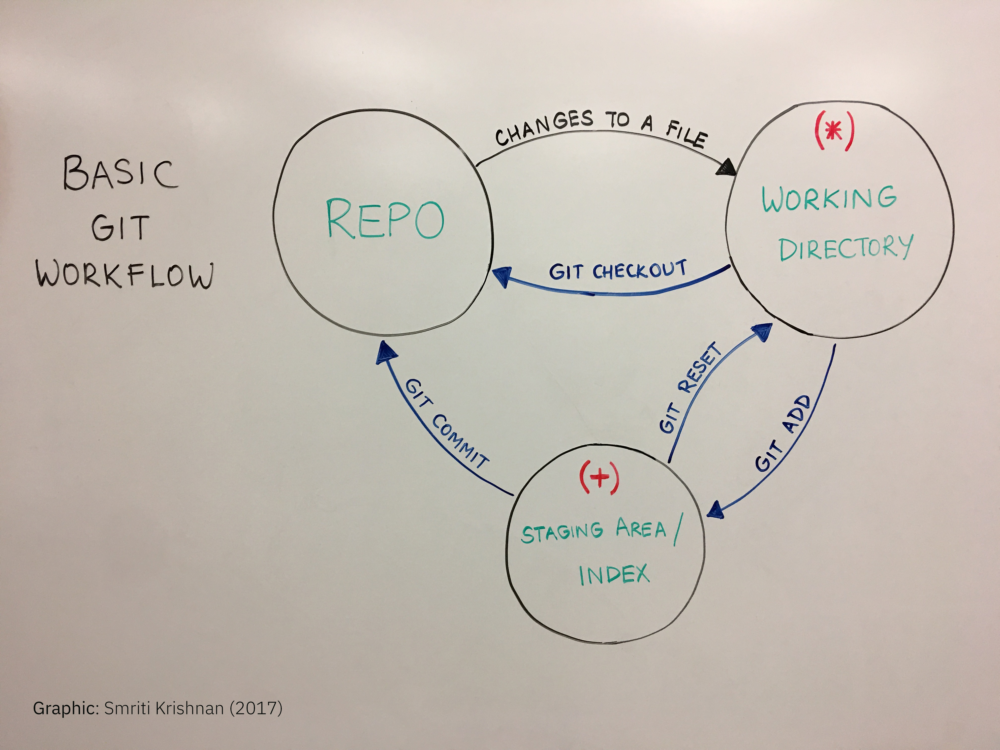

autoscale: true
slidenumbers: true
theme: Simple by Roy Vanegas, 1

# A Git Workshop
### A thorough introduction to Git in three to four hours.

#### Roy Vanegas
#### 22–23 October 2019

---

## What Exactly is GitHub?

GitHub is a user interface, or UI, wrapper around Git, much like Spotify is a UI wrapper around music. In these cases, a core technology (Git; music) is wrapped in a graphical user interface (GitHub; Spotify).

---

## Is GitHub the Only One of Its Kind?

There are other tools that do what GitHub does.

- [Bitbucket](https://bitbucket.org/)

- [Git Tower](https://www.git-tower.com/)

- [Git Lab](https://about.gitlab.com/)

This is only a partial list.

---

## Installing Git

1. **Open a GitHub account** at [https://github.com/](https://github.com/)
2. **Download the GitHub client** at [https://desktop.github.com/](https://desktop.github.com/)

---

## Using Git at The Command Line
### Mac Users
Run `xcode-select --install` in The Terminal to install Git and other command line tools. Choosing this option will require you to manually set up an SSH key. Read [this tutorial](http://www.essential-html.com/generating-an-ssh-key-for-mac-os-x-with-github-or-bitbucket/) on how to do it.

### Windows
In GitHub Desktop, choose `Git Bash` using the following path.
`File → Options (CNTRL + ,) → Advanced → Shell → Git Bash`

Then, type ``CNTRL + ` `` to launch Git at the command line.

---

## Configure Git
### Set name

Every commit needs a username and email. Let’s initiate these settings for all repositories and start with your username:

```bash
git config --global user.name "Roy Vanegas"
```

Check that your username was set:

```bash
git config --global user.name
```

---

## Configure Git
### Set email

Now set your email:

```bash
git config --global user.email "roy@thecodeeducators"
```

And check:

```bash
git config --global user.email
```

---

## Creating a New Repository
### `git init`

In order to put a project under Git’s control, you’ll need to initialize the process inside the project’s root folder, add the files to Git’s staging area, then commit the files. First, we’ll initialize:

```bash
git init
```

This is done once for every new project you’d like Git to watch.

---

## Adding Files to the Repository
### `git add .`

Once you’re ready to commit work to the staging area, you’ll do so via the `add` flag:

```bash
git add .
```

The dot (`.`) means add the current directory and all the changes it contains.

---

## Adding Files to the Repository
### `git add <filename>`

You could also add a single file, as follows:

```bash
git add <filename>
```

---

## Committing Files to the Repository
### `git commit -m <message>`

With files added to the staging area, you’re now ready to commit. Convention dictates that commit messages keep within the limits of 50 to 60 characters. If you cannot summarize your committed work in 60 characters or less, then perhaps your changes are too big. The saying is, “keep your changes small, and commit often.”

---

## Committing Files to the Repository
### `git commit`

Committing changes is the step that registers your changes into the Git directory:

```bash
git commit -m '<message>'
```

You have to include a `<message>` or you won’t be able to commit the change.

---

## Committing Files to the Repository
### `git commit`

Sometimes, you’ll need to explain a small change that has a big impact on your project. For these situations, convention dictates 72-character columns. For example,

```bash
git commit -m 'Change how keyboard emphasis is styled
------------------------------------------------------------------------
First, the spacing around the required key character input was removed.
Next, the character input was emphasized in bold red. And, lastly, an
extra sentence was added to indicate how a user can choose her/his
option.'
```

---


## The 3 States of a File in Git’s View

Files in a Git-controlled repository can only be in one of three states: tracked, ignored, or untracked.

- **Tracked** means Git will track changes and stages associated with a file.
- **Ignored** means Git will explicitly ignore modifications, including deletions, of a file.
- **Untracked** means Git is unaware of a file present in a repository.

---

## The 3 States of a File in Git’s View
### Tracked

When a file has been committed to the repository (via `git add` then `git commit`), the file becomes a tracked file. It can then be in one of three states: modified, staged, or committed.

---

## The 3 States of a File in Git’s View
### Tracked — modified

Modifying a tracked file means that one or more changes were made to the file, but Git has not recorded the changes. The only way to record the changes is to stage them.

---

## The 3 States of a File in Git’s View
### Tracked — staged

Running the `git add .` command stages a file, and one or more files can be added to the staging area with this command. You can then choose to undo the staging of the changes (via `git reset`) or officially record the changes by committing them.

---

## The 3 States of a File in Git’s View
### Tracked — committed

Once staged, the changed files recorded in the staging area can now be moved into the committed state by running the `git commit -m 'MESSAGE'` command and including a brief, 50- to 60-character `MESSAGE` documenting the recorded changes.

---

## The 3 States of a File in Git’s View
### Ignored

A file is ignored when it’s listed in Git’s `.gitignore` file. (Note the `.` preceeding the file name.) Unwanted files, such as Mac OS X’s `.DS_Store` file, and folders, such as WebStorm’s `.idea` folder, would be included in `.gitignore`.

A collection of `.gitignore` files is available on [GitHub](https://github.com/github/gitignore).

---

## The 3 States of a File in Git’s View
### Untracked

An untracked file is one that is neither being tracked nor ignored. Git will not record any changes made to the file, including deleting it. A file is untracked when it’s included anew in an existing repository. To add an untracked file to the repository, it must be explicitly added using `git add`.

**Note:** Adding an empty folder to a repository won’t appear as untracked until it contains a file.

---

## The Pathways of File Changes



      Repo (Git Directory) → Working Directory → Staging Area/Index

As you work with files, their changes move between the working directory, the index, and the Git directory (repo). Modified files live in the working directory, staged files (via the `git add` command) reside in the index, and committed files (via the `git commit` command) go in the Git directory.

---


---

## Cloning a Repository
### `git clone`

Cloning a repository replicates the entire project and Git repository. For example, `git clone git@github.com:code-warrior/git-workshop.git` will create a folder called `git-workshop` in the directory from where you invoked the `clone` command and replicate the entire project and Git history.

This isn’t like downloading a repository on GitHub. When you download a project from GitHub using the `Download ZIP` option, you get the entire project, but not the Git repo.

---

## Checking The Repository’s Status
### `git status`

To see differences sitting in the working directory, changes set in the staging area, untracked files, deleted files, etc, run `git status`.

---

## Checking Differences

File changes can be exposed in the working directory, the staging area, or the history of the project.

---

## Checking Differences
### `git diff`

The `git diff` command shows the differences between the last committed change(s) and the current one(s) in the working directory.

---

## Checking Differences
### `git diff --cached`

The flag  `--cached` shows changes placed in the staging area that have not yet been committed.  If you decide that you want to revert those changes back into the working directory, you can run `git reset`.

---

## Checking Differences
### `git diff` vs `git diff --cached`

Running `git diff` shows changes in the working directory, but not the staging area. Running the command with the `--cached` flag shows what’s in the staging area, but not the working directory. Thus, these two are mutually exclusive.

---

## Checking Differences
### `git log`

To display the entire history of a repository, run `git log`. Append the `--reverse` flag to the command to show the history in reverse.

---

## Checking Differences
### `git log -p`

To display the entire history of a repository, including changes, run `git log -p`. Append the `--reverse` flag to the command to show the history in reverse.

---

## Checking Differences
### `git log -p <filename>`

To display the entire history of a file, run `git log -p <filename>`. Append the `--reverse` flag to the command to show the history in reverse.

---

## Checking Differences — Images

GitHub or the GitHub desktop client are very useful for seeing differences in images. [Play with this demo](https://github.com/cameronmcefee/Image-Diff-View-Modes/commit/8e95f70c9c47168305970e91021072673d7cdad8) to see how it works.

---

## Discarding Changes; Resetting a File

Use `git checkout <filename>` to discard all changes to a file and revert back to the state of the file at the last commit.

---

## Branching

Branching is the ability to take your project in another direction from a certain point. This allows you to create new work based on an existing snapshot of a project without affecting the project. The primary branch Git creates is called `master`. This is merely a convention; you can choose to rename the branch anything else.

---

## Branching

A common branching procedure is to create a `dev` branch in which to do all development, then merge `dev` into `master` at certain points in the development of a project.

Let’s create a `dev` branch from `master`:

```bash
git checkout -b dev
```

---

## Branching

Now, let’s set up a syncing mechanism to our remote repository on GitHub:

```bash
git push --set-upstream origin dev
```

---

## Branching

Now, pushes can be made to `dev`:

```bash
git push
```

---

## Branching

Let’s look at all the remote branches:

```bash
git branch -r
```

---

## Branching

Let’s look at all the local branches:

```bash
git branch -l
```

---

## Branching

Branches can be made from other branches. Let’s create a feature branch from `dev` called `new-navigation`. First, we’ll checkout out the `dev` branch:

```bash
git checkout dev
```

And now we create our new branch:

```bash
git checkout -b new-navigation
```

---

## Merging
### `git merge`

Branches are typically merged into other branches, although they don’t have to be. Issuing the `git merge <branch>` command merges `<branch>` into the current branch. For example, say you want to merge `dev` into `master`. First, checkout `master`:

```bash
git checkout master
```

Then merge `dev`:

```bash
git merge dev
```

---

## Merging
### `git merge --no-ff`

You would have noticed that The Terminal did not ask for any input from you. Most times, however, you want to assign a message to the merge. Appending the `--no-ff` (for no fast forward) to the merge command invokes your text editor so you can associate a message with the merge. Thus, the previous command could be modified as such:

```bash
git merge --no-ff dev
```

---

## Merging

See Vincent Driessen’s [A Successful Git Branching Model](http://nvie.com/posts/a-successful-git-branching-model/) for a more thorough discussion on good branching methodologies.

---

## Pushing
### `git push`

When changes have been placed in the staging area, then committed to the Git directory, they are ready to be pushed (assuming you have a remote repository). The process is simple:

```bash
git push
```

Your changes will be fetched from your local machine and merged into the remote repository.

---

## Pulling
### `git pull`

If you’re working with someone else, or you simply use multiple machines, you’ll need to pull changes made by others (or by you on a different machine) before you can push your changes. Again, the process is simple:

```bash
git pull
```

Your local machine will perform Git’s `fetch` feature, followed by its `merge` feature.

---

## Forking

Forking means that the forked branch is going in another direction. This could be to expand on work already done, or to issue a pull request at a later time. (Pull requests are discussed in the next section.)

Consider Linux: At some point, the folks at Amazon forked the Linux project to create the Kindle operating system. The Linux kernel has also been forked to create different variants of Linux: Debian, Fedora, etc.

---

## Pull Requests

A pull request means that you as the owner of a forked branch of a project are requesting that the owner of the original branch pull your changes into her/his repository. You may or may not have write access to the repository into which you want your changes pulled.

---

## Removing Files

Removing tracked files can be done in one of two ways. The first method excludes Git altogether; you simply delete files as you normally would. You still add the deleted files to the staging area as you would any other file. (Yes, you’re even required to stage deleted files.)

The second method requires the `git rm` command. When files are deleted using `git rm`, deleted files are automatically staged, saving you the trouble of carrying out the `git add` command. This is the only difference between both file removal methods.

---

## Moving Files

Moving files has the same caveats as removing files, discussed previously.

---

## Retrieving a File at a Certain Point in History

You can retrieve a file from any point in history by using its commit ID. Let’s use the repository for these slides as an example. The file I want is `git-workshop.md`, the commit ID is `28ded0fba2757cd9149e1c13be5293deb4453f06`, and I want to place a copy of the file on my desktop:

```bash
git show 28ded0fba2757cd9149e1c13be5293deb4453f06:git-workshop.md > $HOME/Desktop/git-workshop.md
```

---

## Stepwise Bug Search
### `git bisect`

Imagine finding a bug in your project but not knowing which commit introduced it. The command `git bisect` can help with that.

The idea is simple: set a point in the project’s history where the bug isn’t present, then set another point where the bug was introduced.

---

## Stepwise Bug Search
### `git bisect`

First, locate the commit containing the first appearance of the bug. For this example, assume it’s the latest commit: `cddfc8a`. We’ll call this `bad`.

---

## Stepwise Bug Search
### `git bisect`

Next, locate the commit containing the last time the project worked without the bug. Let’s say that was five commits ago: `3379475`. We’ll call this `good`.

---

## Stepwise Bug Search
### `git bisect start`

We’ll start the process:

```bash
git bisect start
```

---

## Stepwise Bug Search
### `git bisect bad`

We’ll now mark the bad commit:

```bash
git bisect bad cddfc8a
```

---

## Stepwise Bug Search
### `git bisect good`

And mark the good commit:

```bash
git bisect good 3379475
```

---

## Stepwise Bug Search
### `git bisect skip`

Load your project into a browser, then skip through each commit one by one:

```bash
git bisect skip
```

---

## Stepwise Bug Search
### `git bisect reset`

When you’ve located the bug, reset the repo and escape the bisect command:

```bash
git bisect reset
```

---

## Storing Changes but Not Committing Them

You may find yourself in a situation where your changes aren’t ready to be committed, but shouldn’t be discarded, either. Enter `git stash`. This command will store your changes for later retrieval. You can reclaim your changes with `git stash pop`, which deletes the changes from the stash’s cache, or `git stash apply`, which keeps the changes in the cache.

---

## If Time Permits

- The Git shell  
- What gets committed and what gets ignored?  
- Adding changes piecemeal  
- Git tag  
- Semantic versioning  
- Setting default branches in GitHub  

---

## Cheat Sheets

There are myriad cheat sheets online. Here are just a few:

- [Atlassian](https://www.atlassian.com/dms/wac/images/landing/git/atlassian_git_cheatsheet.pdf) PDF
- [GitHub](https://education.github.com/git-cheat-sheet-education.pdf) PDF
- [Git Tower](https://www.git-tower.com/blog/git-cheat-sheet/) HTML and other formats and languages
- [Andrew Peterson of NDP Software](http://ndpsoftware.com/git-cheatsheet.html) A fun, interactive cheat sheet

---

## Suggested Readings

- *Git for Humans* by David Demaree.
  Published by A Book Apart, which is known for publishing easy-to-understand short books that are well-designed.
- *[Pro Git](https://git-scm.com/book/en/v2)* by Scott Chacon and Ben Straub.
  **Free** in eBook formats, this is a good reference and very detailed.
- *[Git Pocket Guide](http://chimera.labs.oreilly.com/books/1230000000561/index.html)* by Richard Silverman.
  Available for **free** online, this book is a good, strong reference, and, in paperback, an easy book to carry.
- *[Version Control with Git](http://shop.oreilly.com/product/0636920022862.do)* by Jon Loeliger and Matthew McCullough.
  Every detail you’d want to know about Git is contained in this tome.
